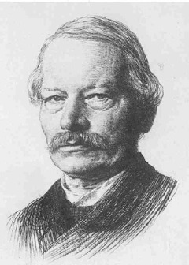

Gustav Freytag
==============

Gustav Freytag, 1816-1895

.. rst-class:: source

  (Radierung von Karl Stauffer-Bern, 1887, Kupferstichkabinett und Sammlung der Zeichnungen, Berlin, Abb. in: Deutsche Schriftsteller im Portrait, Bd 4: Das 19. Jahrhundert. Hg. von Hiltrud Häntzschel. München 1981, S. 50.)
