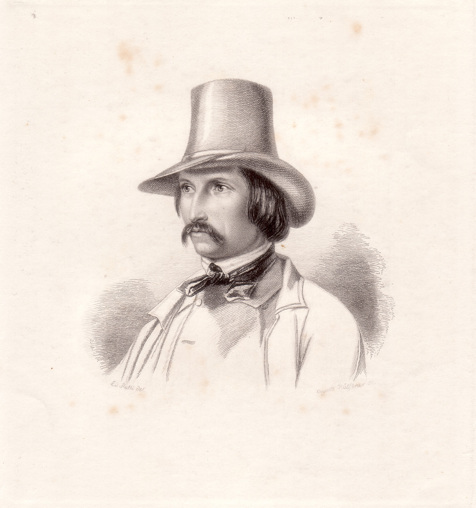

Wilhelm von Kaulbach
====================

Wilhelm von Kaulbach, 1805-1874

.. rst-class:: source

  (Stahlstich, um 1840, gestochen von Auguste Hüssener nach einem Bild von Eduard Ratti, Einzelblatt)
