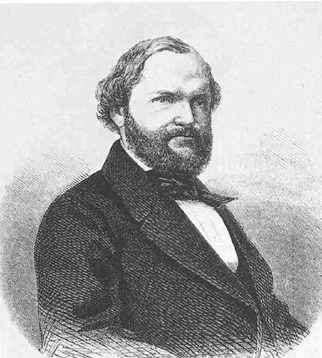

Theodor Mundt
=============

Theodor Mundt, 1808-1861

.. rst-class:: source

  (Holzstich nach einer Photographie aus seinem letzten Lebensjahr, Bildarchiv Preußischer Kulturbesitz Berlin, Abb. in: Deutsche Schriftsteller im Portrait, Bd 4: Das 19. Jahrhundert. Hg. von Hiltrud Häntzschel. München 1981, S. 122.)
