# Gutzkow Digitale Gesamtausgabe

:::::{grid} 1 1 3 3
---
class-container: gutzkow-landing
---
::::{grid-item}
---
class: gutzkow-landing-quotes
---
> Das dritte Stadium der Weltliteratur, das von Rousseau, Sterne, Lessing, Goethe beginnt, ist die **moderne, sociale Poesie**,
> deren Gegenstand **der Mensch** ist: der Mensch des Gemüths, der Sitte, der Geschichte. Es ist die Poesie des Gedankens.
>
> {doc}`Vom deutschen Parnaß (1853) <digitale-gesamtausgabe/schriften-zur-literatur-und-zum-theater/literaturkritik/rezensionen-und-literaturkritische-essays/vom-deutschen-parnass>`

> Ich glaube an die **Zeit**
> die allmächtige Schöpferin Himmels und der Erden,
> und ihren eingebornen Sohn, die **Kunst**,
> welche [...] die Welt erlösen helfen wird,
> und bis dahin glaub’ ich an den heiligen Geist der **Kritik**,
> welchen die Zeit gesandt hat,
> zu richten die Lebendigen und die Todten.
>
> Phönix (1835)

> Ich habe in meiner Jugend nichts gehört,
> als Königl. Hoheit, Königl. Majestät, Geheimer Rath, Excellenz,
> ich bin der Sohn eines Beamten, der jedem seiner Vorgesetzten den ihm nach dem Staatsadreßbuche gebührenden Titel gab und seine Kinder früh zu derselben Unterwürfigkeit erzog.
> Aber ich las, ich forschte in den Alten, mein Geist lechzte nach Freiheit, ich sprengte die Fesseln und werde, da ich einmal knechtisch erzogen bin,
> ewig hassen, was vornehm ist.
>
> {doc}`Vergangenheit und Gegenwart (1839) <digitale-gesamtausgabe/schriften-zur-literatur-und-zum-theater/literaturkritik/schriften-zur-literatur/vergangenheit-und-gegenwart>`

> wir sind noch jung,
> verblendet von der Zukunft;
> wir möchten Wissenschaft u. Leben versöhnen
> u. träumen viel von der Poesie.
> Amphibienartig leben wir halb auf dem Festlande der Politik, halb in den Gewässern der Dichtkunst.
>
> An Ludwig Börne (1835)

> Verloren ist jedes Talent, das sich unter den jetzigen Umständen entschließt, für das sogenannte große Lesepublikum zu schreiben.
> Die Lesewelt soll herauf; nicht der geniale Autor zu ihr hinunter! Was den Autor interessirt, soll die Lesewelt interessiren; nicht umgekehrt!
>
> Telegraph für Deutschland (1838) [Nr. 58, April 1838, S. 464)

> Die Säule, welche man dem Verdienst eines Buchhändlers setzen wollte,
> würde sehr klein gerathen,
> wenn man sie aus dem Honorar schmölze,
> welches die Schriftsteller von ihm bezogen haben.
>
> {doc}`Papilloten (1833) <digitale-gesamtausgabe/gedichte-epigramme-denksprueche/vom-baum-der-erkenntniss-denksprueche-aphorismen-einfaelle-denkblaetter/papilloten>`

> Eigentlich sollte ich mich schämen,
> Gott mit meiner Person zu behelligen.
> Aber seltsam,
> ich fühle, daß sich Gott mit mir beschäftigt.
>
> Vom Baum der Erkenntniß (1868)

> Unsre Zeit emanzipirt nicht zur Revolution,
> sondern aus der Revolution.
>
> Die Zeitgenossen (1837)

> Die Nothwendigkeit der **Politisirung unserer Literatur** ist unläugbar.
>
> {doc}`Briefe eines Narren an eine Närrin (1832) <digitale-gesamtausgabe/erzaehlerische-werke/wally-die-zweiflerin>`

> Alles Bedeutende, das bleiben will, muß **Widerspruch** erfahren […]
> Das, was **Alle** anerkennen, stirbt in der Wärme der Theilnahme ab.
>
> Telegraph für Deutschland (1841)

> Nichts ist täuschender in der Literatur,
> als die oberflächliche Vollendungsfirniß.
> Das Glatte und Ebene ermüdet wohl die Leser nicht,
> ist aber auch um so schneller vergessen.

> Telegraph für Deutschland (1841) [Nr. 55, April 1841, S. 229]

> **Der Zweck der Erde**
> **ist kein historisch-metaphysischer Gesammtzweck,**
> **sondern der einzelne Mensch,**
> **wie er geboren wird und stirbt.**
>
> Zur Philosophie der Geschichte (1836)

> Der Landrath fühlte die Ironie nicht, daß er
> […] ein Kind erzog,
> das durch seine ganze
> polizeiliche Ordnung
> *wie ein Comet fuhr*
> und die Poesie selbst war.
>
> {doc}`Imagina Unruh (1847) <digitale-gesamtausgabe/erzaehlerische-werke/kleine-erzaehlerische-werke-band-1/imagina-unruh>`

> Macht ihr Geschichte, dachte er,
> wir wollen Romane schreiben.
>
> Vorrede zu: Die Ritter vom Geiste (1850-51)

> **Quatsch** ist der Anlauf zum Witz, der,
> auf dem halben Wege stehen bleibend,
> dann natürlich noch hinter dem halben Verstande zurückbleibt.
>
> {doc}`Eine Woche in Berlin (1854) <digitale-gesamtausgabe/reiseliteratur/berliner-eindruecke/eine-woche-in-berlin>`

> Systemveränderungen, Glaubensmetamorphosen
> und ähnliche Revolutionen unsres Innern,
> zu denen man im Alter Jahre braucht,
> machen wir in der Jugend oft in wenigen Stunden durch.
>
> Vom Baum der Erkenntniß (1868)

> – die hier Versammelten riefen die Forderung der Jahrhunderte,
> die unvertilgbar ewige Losung
> und das gottgegebene Erbe der Menschheit:
> Freiheit –! Freiheit –! Freiheit –!
>
> {doc}`Der Zauberer von Rom (1858-61) <digitale-gesamtausgabe/erzaehlerische-werke/der-zauberer-von-rom/index>`
::::
::::{grid-item}
---
child-align: center
---
:::{rst-class} gutzkow-landing-image
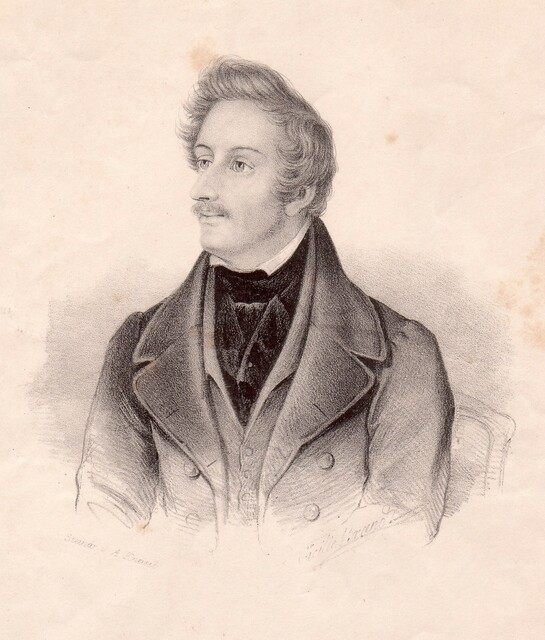
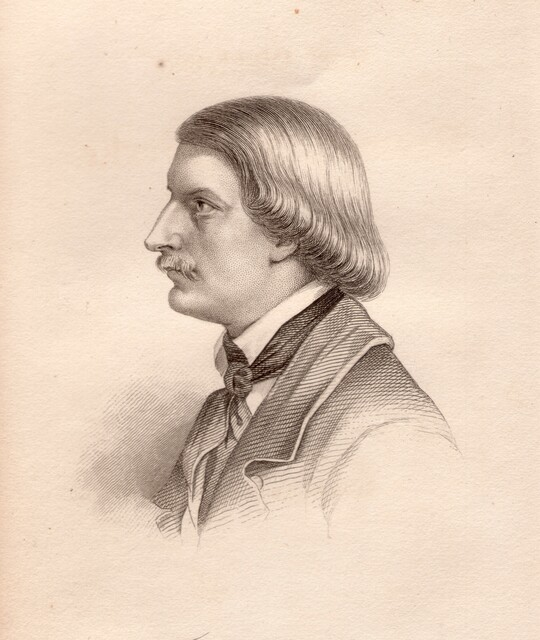
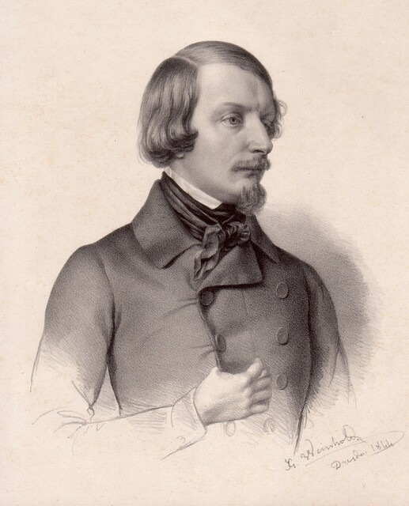
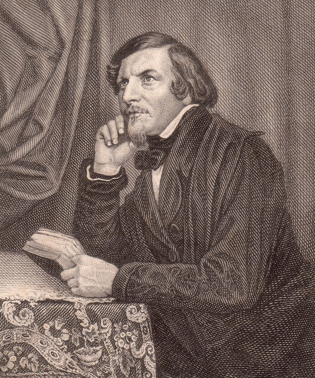
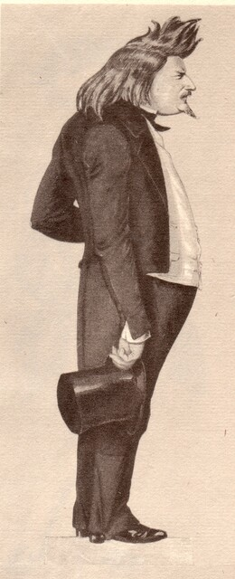
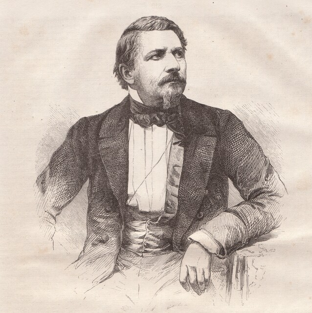
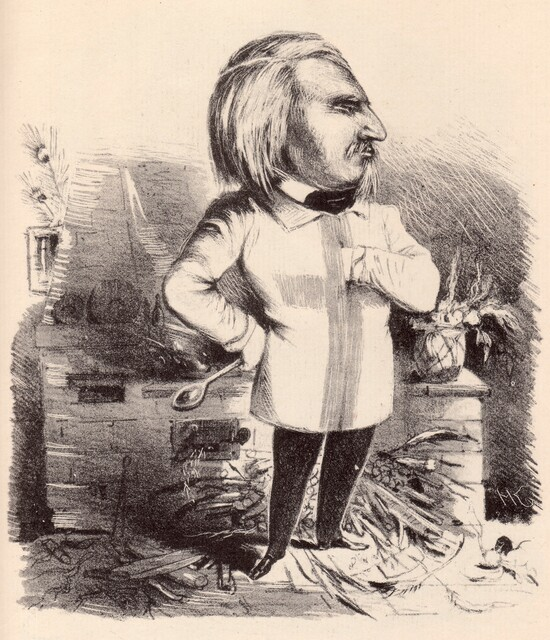
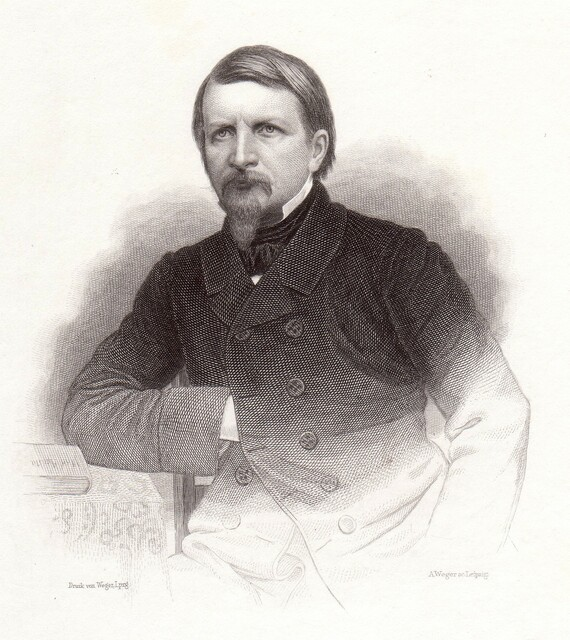
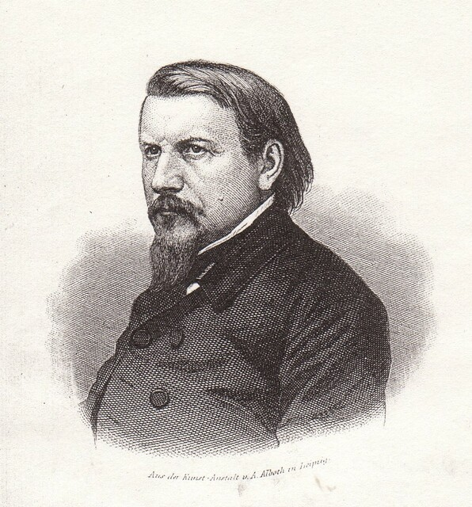
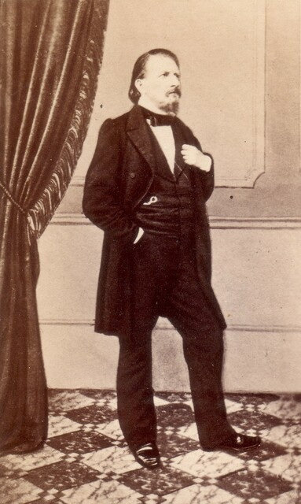
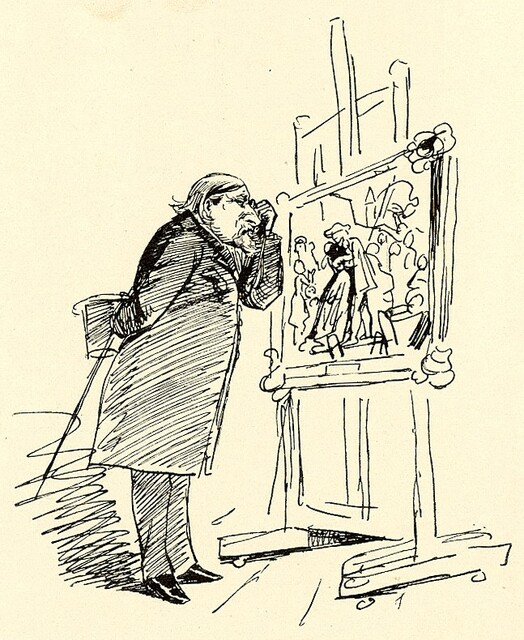
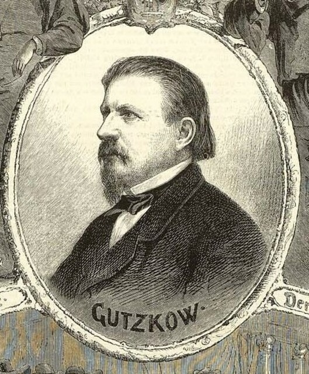
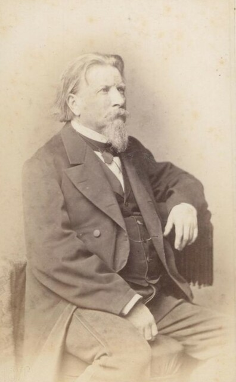
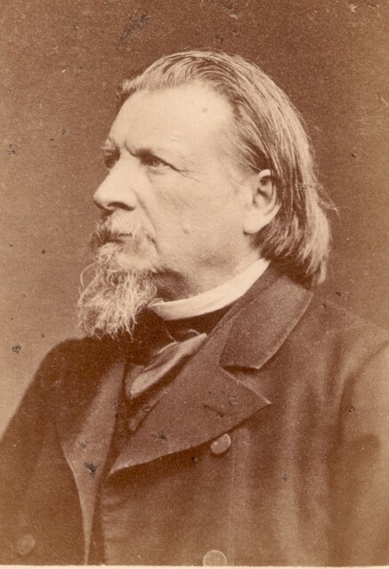
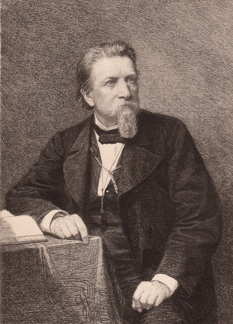
:::
:::{rst-class} text-center small
Emancipation vom Systeme ist Fortschritt
:::
::::
::::{grid-item}
---
class: gutzkow-landing-quotes
---
> Roman, Novelle, die kleine Abhandlung, Briefe, empfindsame Reisen, das sind die einfachsten Formen, mit welchen der moderne Autor
> seine Erfindungen, Träume und Charaktere einfäßt.
>
> {doc}`Die Zeitgenossen (1837) <digitale-gesamtausgabe/schriften-zur-politik-und-gesellschaft/die-zeitgenossen/index>`

> Geboren bin ich den 17 März 1811 in Berlin
> in dem heißen Kometenjahre …
>
> Selbstbiographischer Brief (1837)

> Die Literatur muss Nationalinteresse werden […]
>
> Forum der Journal-Literatur (1831) [Bd. 1, S. 37]

> Die Journalisten sind die Geburtshelfer und Todtengräber der Zeit.
>
> Blasedow und seine Söhne (1838)

> Die Dichterfrau ist nicht nur die
> Taucherglocke des perlenfischenden Dichtermannes,
> sondern auch oft das Meer selbst,
> mit seiner Anmuth und noch öfter seinen Klippen, Untiefen, Strudeln.
>
> Forum der Journal-Literatur (1831) [Bd. 2, S. 39]

> Ach! hätte auch die Welt nie von Gott gewußt,
> sie würde glücklicher seyn!
>
> Vorrede, Schleiermachers Vertraute Briefe (1835)

> Man weiss es ja, was unsre erste Forderung ist –
> **unverkümmerte Pressfreiheit**!
>
> Forum der Journal-Literatur (1831) [Bd. 1, S. 202]

> Hütet euch, ihr Frauen!
> Die Liebe der meisten Männer
> ist nichts als eine Huldigung,
> welche sie sich selbst bringen.
>
> {doc}`Wally, die Zweiflerin (1835) <digitale-gesamtausgabe/erzaehlerische-werke/wally-die-zweiflerin>`

> Wir aber gehen in der Irre
> und benutzen die Waffen des Geistes
> zu jedem Kampf gegen ihn.
> Der Kampf der Finsterniß gegen das Licht
> wird mit Waffen des Geistes geführt.
>
> Die Ritter vom Geiste (1850‐51)

> Ich glaube, Sie taugen zu mehr, als zu einer Erbse,
> welche die offne Wunde der deutschen Revolution in der Eiterung hält.
> Treiben Sie wie ich den Schmuggelhandel der Freiheit:
> Wein verhüllt in Novellenstroh, nicht in seinem natürlichen Gewande:
> ich glaube, man nüzt so mehr, als wenn man blind in Gewehre läuft, die keineswegs blindgeladen sind.
>
> An Georg Büchner (1835)

> Ach! jammerte das Volk. Das schöne,
> schöne Mädchen! […] Diese Hand! Dieser Fuß!
> Der junge Arzt dachte dasselbe und freute sich über die Eroberung
> für seinen Secirtisch.
>
> {doc}`Die neuen Serapionsbrüder (1877) <digitale-gesamtausgabe/erzaehlerische-werke/die-neuen-serapionsbrueder/index>`

> Die Censur hat mich einmal wieder maltraitirt heute:
> man soll nicht sagen, daß diejenigen,
> welche der Staat mit Stricken um den Hals lohnt,
> von der Literatur mit Lorbeerkränzen bedacht werden.
>
> An Gustav Schlesier (1835)

> Die Dichter gleichen den einsamen Botenläufern,
> die Morgens in aller Winterfrühe, wenn noch kaum die Hähne gekräht haben, auf den des Nachts vom Schnee verschütteten Wegen die ersten Fußtapfen wieder eindrücken müssen. Ihr habt Mittags gut wandeln! Gedenkt der Botenläufer, die […] auf unübersehbaren Schneeflächen zuerst die Wege wieder suchen mußten und dabei keinen anderen Führer hatten, als den Rauch aus jenen fast unsichtbaren, weiß verhangenen Schornsteinen,
> wo man euch Bequemen schon in aller Frühe den labenden Mocca siedet!
>
> Vergangene Tage (1852)

> Excellenz! Excellenz! **Herr Geheimerrath**!
> rief man in alle Winkel hinein
> und in alle Gruben hinunter,
> ja in solchen suchte man den geheimen Rath,
> die man sonst nur für geheimen Unrath bestimmte.
>
> Die Ritter vom Geiste (1850‐51)

> Der Autor glaubte durch eine Betrachtungsweise,
> wo Ein Dasein unbewußt immer wieder Schale oder Kern eines andern ist,
> wo jede Freude von einem Schmerze benachbart ist,
> der über Das, was jene himmelhoch erhebt, seinerseits tief zu Boden gedrückt sein kann und wo andererseits eine Unbill auch schon wieder unbewußt den Rächer auf ihren Fersen haben wird,
> den **Roman** noch mehr als früher zum **Spiegel des Lebens** gemacht zu haben.
>
> Unterhaltungen am häuslichen Herd (1854)

> Die verwitterte Gestalt […]
> hebt die Vorhangsfetzen des Wagens auf
> und schiebt sich langsam hinein
> in ein damaliges — Asyl für Obdachlose.
>
> {doc}`Eine nächtliche Unterkunft (1870) <digitale-gesamtausgabe/reiseliteratur/berliner-eindruecke/eine-naechtliche-unterkunft>`

> Er starb,
> wie ein Schriftsteller des 19. Jahrhunderts stirbt,
> mit der Feder in der Hand,
> mit dem letzten Correcturbogen seines gerade im Drucke befindlichen Werkes auf der Decke seines Krankenlagers,
> mit dem letzten schmerzlichen Seufzer des zurücksinkenden Hauptes und zusammenbrechenden Körpers:
> Ich kann nicht mehr!
>
> {doc}`Ein deutsches Dichterleben (1853) <digitale-gesamtausgabe/schriften-zur-literatur-und-zum-theater/literaturkritik/schriften-zur-literatur/ein-deutsches-dichterleben>`
::::
:::::
